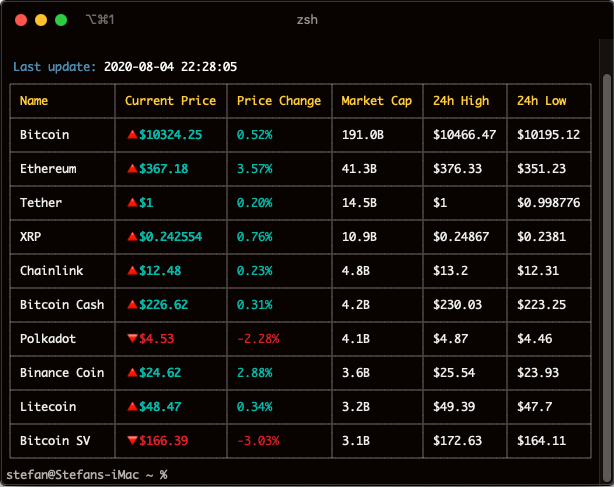

# crwatch

`crwatch` is a CLI tool for displaying live cryptocurrency prices and drawing charts.

## Requirements

For development, you will only need Node.js and a node global package, Yarn, installed in your environement.

### Node

- #### Download

Just go on [official Node.js website](https://nodejs.org/) and download the installer.

- #### Package

You can install nodejs and npm easily with apt install

`$ sudo apt install nodejs`

`$ sudo apt install npm`

## Install

`$ git clone https://github.com/stefan-krstikj/crwatch`

`$ cd crwatch`

`$ sudo npm install -g`

## Configure colors

Open `config.json` to edit the colors of the table. <b>crwatch</b> uses [chalk](https://www.npmjs.com/package/chalk) for the colors

## Running

`crwatch`
`crwatch -w [timeout]` to auto-refresh the table every [timeout] interval (minimum 30)
`crwatch c [coin]` to draw the chart of a [coin] specified
`crwatch ping` to check the API status
