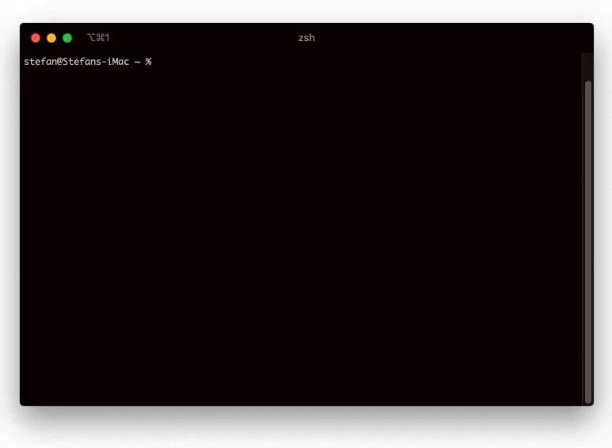

# crwatch

`crwatch` is a customizable CLI tool for displaying live cryptocurrency prices and drawing charts. It has the ability to monitor and update the prices continously with a given timeout, and it is the only interactive cryptocurrency command line monitor app.

  

## Install
You can install <b>crwatch</b> using npm or you can clone the project and install it from the repository

 #### 1. Using npm
 `$ npm i -g crwatch`
 
 #### 2. Cloning the project yourself
`$ git clone https://github.com/stefan-krstikj/crwatch`

`$ cd crwatch`

`$ npm install -g`

## Usage

* `crwatch --help` - display usage information
* `crwatch` - display top 10 cryptocurrencies sorted by market cap
    * `-t, --top [n]` - Top n cryptocurrencies instead of 10
    * `-w, --watch [timeout]` - enter interactive mode, auto-refresh the table every [timeout] interval (minimum 30)
* `crwatch c [coin]` - draw the chart of a [coin] specified
* `crwatch ping` - check the API status

## Configure colors

Open `config.json` to edit the colors of the table. <b>crwatch</b> uses [chalk](https://www.npmjs.com/package/chalk) for the colors

## Requirements

You will only need Node.js and a node global package, npm, installed in your environement.

### Node

- #### Download

Just go on [official Node.js website](https://nodejs.org/) and download the installer.

- #### Package

You can install nodejs and npm easily with apt install

`$ sudo apt install nodejs`

`$ sudo apt install npm`
